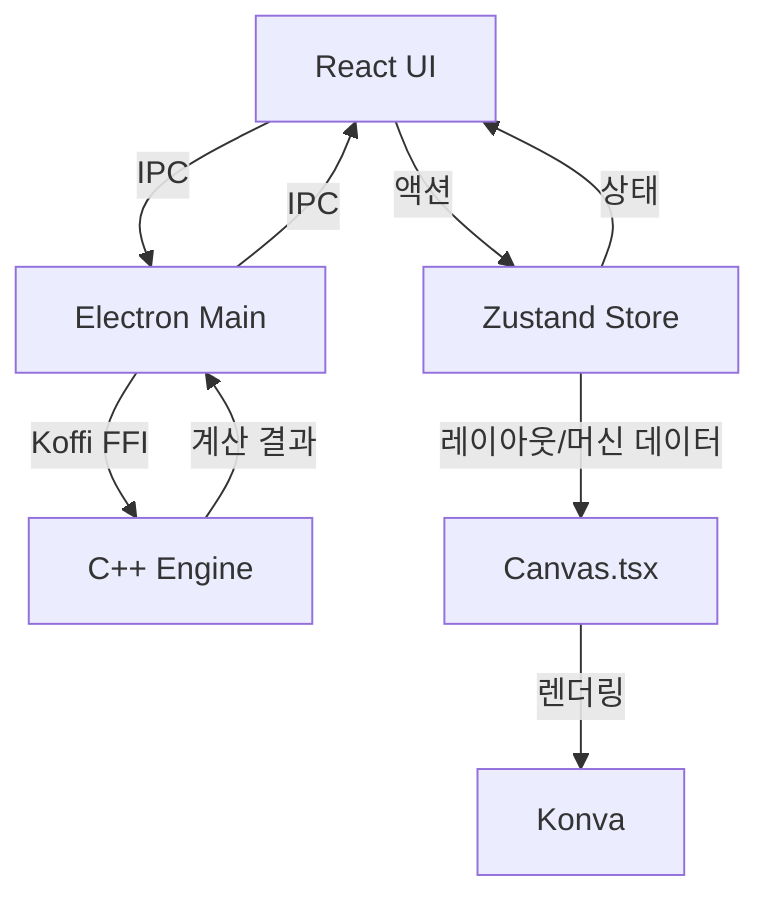

# 📊 데이터 흐름

## 시스템 아키텍처



---

## 🔄 흐름 설명

| 단계 | 설명 |
|------|------|
| 1. **사용자 액션** | React UI에서 버튼 클릭 |
| 2. **상태 업데이트** | Zustand 스토어에서 상태 변경 |
| 3. **렌더링** | Canvas가 Konva를 통해 그래픽 표시 |
| 4. **계산 요청** | IPC를 통해 메인 프로세스로 전달 |
| 5. **C++ 엔진 호출** | Koffi FFI로 네이티브 함수 실행 |
| 6. **결과 반환** | IPC를 통해 UI에 표시 |

---

## 📦 통신 구조

### React ↔ Electron (IPC)

```
React Component
    ↓ window.electron.invoke('calculate-area', ...)
Preload Script (preload.ts)
    ↓ ipcRenderer.invoke(...)
Main Process (main.ts)
    ↓ ipcMain.handle(...)
C++ Engine (via Koffi)
```

### 상태 관리 (Zustand)

```
User Action → Zustand Action → State Update → React Re-render
```

---

**다음 문서**: [C++ 엔진](../components/cpp-engine.md)
